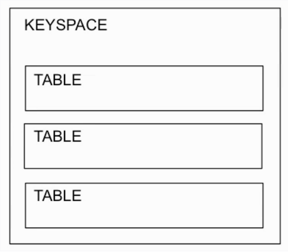
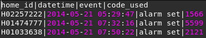
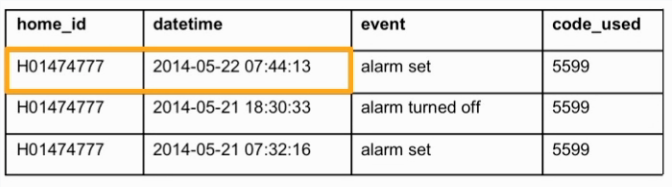
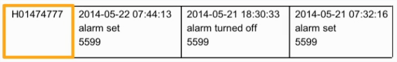
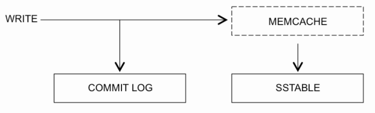

# 1. Undestanding What Cassandra Is

## 1.1 Apache Cassandra is

- Open Source
- A NoSQL database technology
- A distributed database technology
- A big data technology ehich provides massive scalability
- Commonly used to create a database that is spread across nodes in more than one data center, for high availability
- Based on Amazon Dynamo and Google Big Table
- Is Linear scalability (adding more nodes != losing performance)
- Fault-tolerance (each node has a master funcionality)
- Commodity Hardware (no need to buy specific hardware to run Cassandra)

## 1.2 System Requirements

- 64-bit operating system (Macintosh, Windows or Linux)
- 8GB (or more) of RAm
- 30GB (or more) of free hard drive space

# 2. Cassandra Basics

## 2.x Cassandra Status Commands

- <kbd>$ nodetool status</kbd> shows the status of cluster cassandra
- <kbd>$ nodetool info</kbd> shows specific information about the node
- <kbd>$ nodetool ring</kbd> shows wich node is responsible for wich token

## 2.x Accessing log files

- <kbd>$ nodetool getlogginglevels</kbd>

# 3. Ways to Communicate With Cassandra

- CQL (Cassandra Query Language) is a SQL-like query language for communicating with Cassandra, created to make it easy for people familiar with SQL to work with Cassandra.
  - CQL example <kbd>SELECT home_id, datetime, event, code_used FROM activity;</kbd>
  - Like SQL, CQL commands are not case-sensitive
  - Although CQL looks similar to SQL, it does not have all of the same options as SQL, due to the distributed nature of a Cassandra database
  - <https://docs.datastax.com/en/cql-oss/3.x/cql/cql_using/useAboutCQL.html>
  - <https://docs.datastax.com/en/dse/5.1/cql/cql/cql_reference/cql_commands/cqlCommandsTOC.html>
  - cql support cqlsh commands too <https://www.simplilearn.com/cassandra-interfaces-tutorial-video>
  - cqlsh command example: <kbd>cqlsh> DESCRIBE CLUSTER;</kbd> for a complete command list: <kbd>cqlsh> HELP</kbd>
- Thrift is a low-level API, currently still supported in Cassandra (support may be phased out in future releases of Cassandra)
- For administrative activities, such as cluster monitoring and management taks, tools built on **JMX** (Java Management Extensions) are commonly used.

# 4. Cassandra Database

## 4.1 Understanding a Cassandra Database

- In Cassandra, a database is defined as a kayspace
- Within the keyspace, tables can be defined  
- To see all keyspaces <kbd>cqlsh> DESCRIBE KEYSPACES</kbd>
- To see all information about a specific keyspace <kbd>DESCRIBE KEYSPACE keyspace_name</kbd>

## 4.2 Defining a Keyspace

- A keyspace can be defined through the *CREATE KEYSPACE* command
- Example: <kbd>CREATE KEYSPACE keyspace_name WITH REPLIACTION = { 'class' : 'NetworkTopologyStrategy', 'dc1' : 3, 'dc2' : 2};</kbd>
  - 'NetworkTopologyStrategy' = Spread across in more than one data center
  - Or 'SimpleStrategy' = Share database in only one data center
  - 'dc1' : 3 = replication factor(in data center 1 we gonna have 3 replications)

## 4.3 Deleting a Keyspace

- <kbd>DROP KEYSPACE keyspace_name;</kbd>

## 4.4 Using a Keyspace

- Entering a keyspace:
  - The *USE* command is for specifying which keyspace any subsequent CQL commands are for
  - <kbd>USE keyspace_name;<kbd>

## 4.5 Creating a Table

- A table can be created in Cassandra by using the *CREATE TABLE*
- Example: <kbd>CREATE TABLE table_name (column1_name data type, column2_name data type</kbd>
  - for all data types: <https://docs.datastax.com/en/cql-oss/3.x/cql/cql_reference/cql_data_types_c.html?hl=cql%2Cdata%2Ctypes>

### 4.5.1 Creating a Primary Key

- Like in relational databases, a primary key in Cassandra is for having a way to uniquely identify a record in a CQL table
- In Cassandra is possible to have a combinations of fields to constitute a primary key <kbd>PRIMARY KEY (column1, column2)</kbd>
  - To define a simple primary key column: <kbd>PRIMARY KEY (column_name)</kbd>or <kbd>column_name data_type PRIMARY KEY</kbd>
- Cassandra always get the first value of the primary key to do the hash process and so define to which cluster (based on tokens) the data goes.
- A table can be defined to store it's data in ascending (default) or descending order <kbd>...) WITH CLUSTERING ORDER BY (column_name DESC);</kbd>
  - Specifying descending causes writes to take a little longer, as cells are inserted at the start of a partition, rather than added at the end, but improves read performance when descending order is needed by an application.
  - Although some changes can be made to an existing table, such as adding a column through the *ALTER TABLE* command (e.g. <kbd>ALTER TABLE  activity ADD status text;</kbd>), changing the clustering order of a table is not an option.

## 4.6 Deleting a Table

- A table can be deleted by using the *DROP TABLE* command
- <kbd>DROP TABLE table_name;</kbd>

## 4.7 Checking a Table properties

- <kbd>DESCRIBER TABLE table_name</kbd>

# 5 Ways to Write Data

There are a few different ways to write data to a Cassandra table, including:

- INSERTO INTO ***command***
  - Can be used in cqlsh (command line) or with via a client driver
- COPY ***command***
  - Useful to import data **FROM** a CSV file
  - Can be used to export data **TO** a CSV file
- **sstableloader tool** it's used to a bulk load. Commonly used to transfer data to a live cluster
  - To load data with sstableloader tool the data has to be in sstable format

## 5.1 INSERT INTO

- INSERT INTO is handy for writing a single row of data, like from a client application, or manually on the command line
- To use *INSERT INTO*, the name of the table that the data is to be written to, the names of the columns that the data is to go into, and the data that is to be written all need to be specified
  - <kbd>INSERT INTO table_name (column1_name, column2_name, ..., column(n)_name) VALUES (value1, value2, ..., value(n));</kbd>
    - To access data the *SELECT* command can be used. To select all rows with data in any of the columns in a table <kbd>SELECT * FROM table_name;</kbd>. Or you can specify the number of column <kbd>SELECT column1_name, column2_name, columns3_name FROM table_name;</kbd>

## 5.2 UPDATE

- The *UPDATE* command can be used to update data stored in Cassandra
- For example <kbd>UPDATE keyspace.table_name SET field_name = values WHERE field_name = value;</kbd>
- More than one item can be specified in the *SET* clause by using a comma ,<kbd>UPDATE keyspace.table_name SET field_name1 = value, field_name2 = value WHERE field_name = value;</kbd>
  - When doing an update in Cassandra, unlike relational databases there is no disk seek to find a record, update it's data, and save it, instead, an update is essentially another write.
  - For example, the update done in the upper command was simply a write to a memtable, to eventually get flushed to a new SSTable once the memtable is full
  - The secret to the update command is the internal timestamp, even when you don't use a timestamp field, Cassandra does. In every record Cassandra save the data with an internal timestamp and when a update happens Cassandra don't delete the old record or really make an erase and insertion, it simply check the timestamp in a conflicting fields and get the data with the most recent rimestamp

## 5.3 DELETE

- There are a number of CQL commands that can be used to delete data in Cassandra, including *DELETE*, *TRUNCATE*, and *DROP*
- *DELETE* can be used to delete a value in a column, or delete a row or rows
  - For example <kbd>DELETE field FROM table WHERE field = value</kbd>
  - With multiples filters <kbd>DELETE field1 FROM table WHERE field2 = value AND field3 = value</kbd>
  - Deleting an entire row <kbd>DELETE FROM table WHERE field2 = value AND field3 = value</kbd> same is applied to a deletion without filters
- *TRUNCATE* can be used to delete all of the rows in a table
  - For example <kbd>TRUNCATE table_name</kbd>
- *DROP* can be used to delete a table or a keyspace
  - Deleting a table example <kbd>DROP TABLE table_name</kbd>
  - Deleting a keyspace example <kbd>DROP KEYSPACE keyspace_name</kbd>

### 5.3.1 Understanding Tombstones

- When a delete is written to Cassandra, a tombstone is created, marking the data for deletion. The reason that data is not immediately deleted is so that there is time for all of the nodes with a replica of the data (like any down nodes) to learn about the mark for deletion. If the deletion were to happen immediately, while a replica node is down, it would be possible for the down node to come back up and replicate the data to the node that had previously delete it, unaware of the delete
- The minimum amount of time that must pass before a delete can occur (and its corresponding tombstone) is set in the ***gc_grace_seconds*** property for the table. By default, the value of ***gc_grace_seconds*** is 864000s (10 days). Once the ***gc_grace_seconds*** amount of time has passed, the data is eligible for deletion
  - To see the value of ***gc_grace_seconds*** use <kbd>DESCRIBE TABLE table_name;</kbd>
    - To change ***gc_grace_seconds*** <kbd><kbd>
- For the data to actually delete, **compaction** needs to happen
  - Compaction is when SSTable are combined, to improve the performance of reads due to the fewer number of SSTables, and to reclaim disk space from deleted data. Compaction is normally done automatically, although it can also be started manually, by using the ***nodetool compact*** command
    - <kbd>nodetool compact keyspace_name table_name</kbd>
  - Compation runs when exist 4 SSTables with the same size, when this happen Cassandra merge this 4 SStable in one and create a 5th updated SSTable

## 5.4 COPY \/

- The copy command can be used to import data (COPY FROM) from a .cdv file to a Cassandra table, or export data (COPY TO) to a .csv file  
Considering this scenario:  
  
- To import with *COPY* command <kbd>COPY table_name (home_id, datetime, event, code_used) FROM '/way/to/csv/file.csv' WITH header = true AND delimiter = '|';</kbd>

## 5.5 How Data is Stored in Cassandra

- In CQL, a row's primary key value is what makes it unique

- Internally, a partition key value is what makes an internal storage row unique

  - Note that the first column is a partition key and the other columns are the concatenation of all values in a row that belongs to all occurrences of the partition key

## 5.6 How Data is Stored on Disk

- When data is written to a table in Cassandra, it goes to both a commit log on disk (for playback, in case of node failure) and to memory (called memcache)
- Once the memcache for a table is full, it is flushed to disk, as an SSTable

- The SSTables for a table are stored on disk, in the location specified in the cassandra.yaml file.
  - By default, in the /var/lib/cassandra/data directory

# 6 Modeling Data

## 6.1 Understanding Data Modeling in Cassandra

- When data modeling in Cassandra, it is important to undrestand the implications of working with a distributed database versus a relational one.
- The fact that **joins do not exist** in Cassandra is perhaps the most significant data modeling difference between a distributed database versus a relational database
- As a result, data modeling in a Cassandra database needs to be done in a way so that all the data for a query is available in one table

## 6.2 Using a *WHERE* Clause

- As Cassandra is a distributed database with the data organized by partition key, *WHERE* clause queries generally need to include a partition key
- From example <kbd>SELECT * FROM table WHERE column = value;</kbd>
- Another example <kbd>SELECT * FROM table WHERE column1 = value AND column2 > value;</kbd>
  - It's possible if <kbd>PRIMARY KEY(column1, column2)</kbd> because with that,  column1 and column2 is indexed
- Not is possible to use *WHERE* command in a column that wasn't indexed

## 6.3 Understanding Secondary Indexes

- By creating an index for columns beyond the partition and clustering columns, values in these other columns can be referenced in *WHERE* clauses.
- We call these ***secondary indexes***
- For each secondary index, Cassandra creates a hidden table on each node in the cluster
  - It is important to know that, contraty to indexes in relational databases, creating secondary indexes does not increase the speed of queries in Cassandra
  - Secondary indexes simply make it so that *WHERE* clauses that reference values in columns beyond the primary and clustering columns can run
  - For increasing the speed of a query, instead of defining a secondary index, you could create a table specifically for the query
- To create a secondary index <kbd>CREATE INDEX index_name ON table_name (column_name);</kbd>
  - To use that secondary index you can simply use the original column name in a *WHERE* clause

## 6.4 Defining a Composite Partition Key

- A composite partition key is where a partition key is made up of more than one column
- For example <kbd>CREATE TABLE location (vehicle_id text, date text, time timestamp, latitude double, longitude double, PRIMARY KEY ((vehicle_id, date), time));</kbd>

# 7 Using TTLs

## 7.1 Creating Data With TTL
- TTL stands for Time To Live, and is a way to specify an expiration date for data that is being inserted
- For example <kbd>INSERT INTO table_name (column1_name, column2_name, ..., column(n)_name) VALUES (value1, value2, ..., value(n)) USING TTL 30;</kbd>
  - The time unit for TTL is in seconds
- TTL values are marked with tombstones once they have expired. Then, once the ***gc_grace_seconds*** has passed, the data can be deleted from disk throught compaction

## 7.2 Updating TTL

- A TTL value can be updated via the ***UPDATE*** command, with the ***USING TTL*** clause
- For example <kbd>UPDATE table_name USING TTL number_in_seconds SET column_name = value WHERE column_name = value</kbd>

# 8 Selecting Hardware

## 8.1 Understanding Hardware Choices

- Hardware choices matter for the performance of Cassandra
- Althought Cassandra does not require special hardware, it is imortant to ensure that at least the minimum recommendations for ROM, CPU and storage are met

## 8.2 Understanding RAM and CPU recommendations

- The minimum amount of RAM recommended per Cassandra node is 8Gb
- In prodution, 32Gb of RAM per node is common
- The more memory that is available, the batter Cassandra's read performance is. This is because, the more data that is already cached, the less chance that disk seekds will be needed (wich are, of course, time-consuming)
- Like RAM, the more CPU power that exists, the better Cassandra's performance will be
- Cassandra is highly concurrent and will take advantage of multiple cores
- The minimum number of recommended core is 4
- In production, 8 or more cores is common

## 8.3 Selecting Storage

- The type of storage used for Cassandra can greatly effect performance
- Storage considerations include wheter the storage is shared, type of drive and capacity
- Shared storage can have a significantly negative effect on the performance of Cassandra
- This is because, if the disk head is often beign pulled to service others, it will take longer to service the requests to your database
- Hence, it is highly recommended to NOT use shared storage
- For type of drive, SSDs (solid state drives) are preferred
- They provide much daster performance than spinning disks. Having said that, either can be used with Cassandra
- With regards to capacity, it is generally better (for performance) to have more nodes in your cluster, with less data on them, rather than just a few codes in the cluster, with tons of data on them
- The recommended amount of data per node varies with the type of disk being used, but is generally from 500Gb to 1Tb
- To provide maximum write performance, it is recommended to have a separate drive for the commit log
- By having a separate drive for the commit log, the disk head does not need to move, and so can continuously be used to write commit log entries
- It is fine for the commit log disk to be a spinning disk, as the disk head does not need to move
  - This configuration can be defined in cassandra.yaml file

## 8.4 Deploying in The Cloud

- Amazon AWS EC2

| Data per Node | Instance Type | Memory | Disk      | Network Performance |
|---------------|---------------|--------|-----------|---------------------|
| < 100Gb       | m1.xlarge     | 15Gb   | Ephemeral | High                |
| < 100Gb       | c3.2xlarge    | 15Gb   | SSD       | High                |
| < 1 Tb        | i2.2xlarge    | 60Gb   | SSD       | High                |

- Google Cloud Compute Engine

| Data per Node 	| Instance Type 	| Memory 	| Disk                 	|
|---------------	|---------------	|--------	|----------------------	|
| < 200Gb       	| n1-standard-8 	| 30Gb   	| 2 Tb persistent disk 	|
| < 1Tb         	| n1-highmen-16 	| 104Gb  	| 4 Tb persistent disk 	|

# 9 Adding Nodes to a Cluster Cassandra

## 9.1 Understanding Cassandra Nodes

- As each node in a Cassandra cluster has the same functionality as the others, it is fairly easy to add a new node
- to add a new node, it needs:
  - To have the same cluster name as the existing nodes in the cluster
  - The UP address (and network access) to at least one of the nodes in the existing cluster

## 9.2 Specifying the IP Adress of a Node in Cassandra

- The listen_address and rpc_address properties in the cassandra.yaml file of each node ned to be assigned the IP address of the node
  - listen_addres: is used to other nodes to communicate with the current node
  - rpc_address: is used to communicate with a client application

## 9.3 Specifying Seed Nodes

- Seed nodes are regular nodes that, via their IP address, provide a way for new nodes to join the cluster
- The IP address for at least one sed node is needed for a node to be able to join the cluster
- Seed nodes are specified in the seeds property of the cassandra.yaml file of each node in a cluster as a comma-separated list
  - e.g. <kbd>seeds: "192.168.159.101, 192.168.159.102</kbd>
- It is common to list the IP address of the first two or three nodes in a cluster, so that if the first node is down, there is an alternative node for any joining nodes to use to get into the cluster

## 9.4 Bootstrapping a Node

- Adding a node to a cluster is called "bootstrapping"
- In order to bootstrap a node, it needs to have the same cluster name as the nodes in the cluster it is to join, and it needs to be on a network that allows it to connect to the IP address of at least one of the seed nodes
- Once a node is able to join a cluster, if the auto_bootstrap property is set to true, the node will start to take on responsibility for the data in it's token range(s)
- The node will begin by accepting write requests and then eventually also accept read requests
- If there are multiple nodes to be bootstrapped, give time between each one so that the cluster can smoothly bootstrap each node

## 9.5 Cleaning Up a Node

- When a node auto bootstraps, it does not remove the data from the node that had previously been responsible for the data. This is so that, if the new node were to go down shortly after coming online, the data would still exist
- To tell Cassandra to delete the data that a node is no longer reponsible for, the cleanup command can be used
  - <kbd>nodetool -h IP_ADDRESS cleanup</kbd>

## 9.6 Using cassandra-stress

- The cassandra-stress tool, which comes with Cassandra, is handy for stress-testing a cluster
- It can be used to write data, or read data, from a Cassandra cluster
  - Fro example, cassandra-stress could be used to generate and write 100000 rows of data
    - <kbd>cassandra-stress write n=100000 -node IP_ADDRESS</kbd>
    - In using cassandra-stress, a keyspace with a replication factor of 1 named Keyspace1 gets generated. Within Keyspace1, tables named Standard1, Super1, SuperCounter1, Counter1, and Counter3 are generated depending on the cassandra-stress option used
  - The cassandra-stress tool has many options, which can be viewed by running <kbd>cassandra-stress -h</kbd>

# 10 Monitoring a Cluster

Tools for monitoring Cassandra include nodetool, JConsole ans OpsCenter. All of these tools work by communicating with Cassandra through JMX (Java Management Extesions). Through JMX, Cassandra exposes many metrics and commands, which any of these tools can use to monitor and manage a Cassandra cluster.

## 10.1 Nodetool

- Provided with Cassandra, nodetool is available on the command line via it's excutable, located in the bin subdirectory where Cassandra is installed
  - <kbd>$ bin/nodetool status</kbd> to see basic informations about the cluster
  - <kbd>$ bin/nodetool info</kbd> for information on a particular node
  - <kbd>$ bin/nodetool ring</kbd> for seeing which node each token range is assigned to
  - <kbd>$ bin/nodetool cfstats</kbd> to see statistics for all the key spaces in tables
    - CF stands for "Column Family" which is the old phrase for table
  - <kbd>$ bin/nodetool cfhistograms</kbd> to see the read and write latency for a given table
  - <kbd>$ bin/nodetool comapactionstats</kbd> to see compaction information
  - To get all possible commands execute <kbd>$ bin/nodetool</kbd>

## 10.2 JConsole

- JConsole, which comes with JDK, is a tool for looking inside a Java process
- Look for your Java's directory <kbd>$ update-alternatives --config java</kbd>
- Open your Java's directory <kbd>$ cd /path/to/jdk/jdkver.si.on_release</kbd>
- Open jconsole <kbd>$ bin/jconsole &</kbd>
- Select the "Remote Process" radial buttom and then type "localhost:7199"
- It will appear an "insecure" option, choose that one
- After that will appear a screen with some informations, look for a tab called "MBeans". On this tab look for "org.apache.cassandra.metrics" you'll find a loot of metrics about cassandra.

## 10.3 DataStax OpsCenter

- DataStax OpsCenter is a GUI web application for managing a Cassandra cluster
- To be able o use OpsCenter, OpsCenter needs to be installed on a server, and then OpsCenter Agent needs to be insalled on each of the nodes in the cluster, so that OpsCenter can communicate wit each of the nodes
- Once OpsCenter is installed, it can be accessed by opening a browser window and specifying the I address of the server that it is installed on, with 8888 as the port number
- For the installantion check DataStax site <https://docs.datastax.com/en/install/6.7/install/installDSagents.html>

# 11 Repairing Nodes

## 11.1 Understanding Repair

- Repair is for updating a node's data to be current
- This comes into play when you are using a repliaction factor higher than 1
- Examples of reasons for why data can get outdated on a node include that the node has been down, that the replication factor for a keyspace has been increased (in decreasing the replication factor, you would just do a cleanup), or that the token range(s) for a node have changed
- Repair should be run on each nodeat least once within the gc_grace_seconds period of time, so that data marked as deleted on one node does not come back to life through another node, because the other node was unaware of the delte (e.g. from being down)
- Given that the default gc_grace_seconds value is 10 days, running repair at least **once a week** is recommended
- Although it is not common to change the replication factor of a keyspace, it is possible with the *ALTER KEYSPACE* command
  - <kbd>ALTER KEYSPACE keyspace_name WITH REPLICATION = {'class':'SimpleStrategy', ' replication_factor':2};</kbd>

## 11.2 Repairing Nodes

- To repair nods, the nodetool repair command can be used <kbd>$ bin/nodetool -h IP_ADDRESS repair</kbd>
- To specify the repairing of just one keyspace (e.g. after increasing the replication factor of a specific keyspace), the keyspace name can be included in the nodetool repair command <kbd>bin/nodetool -h IP_ADDRESS repair keyspace_name</kbd>
- Since repair can put a heavy load on the cluster, it is best to run repair during low-usage hours and to **stagger** the repairing of nodes so that the system is not overwhelmed with comparing and reconciling data on all the nodes at the same time
- If using OpsCenterEnterprise, there is an option to have OpsCenter automatically run a continuous repair service in the background, with minimal impact on the performance of the cluster 